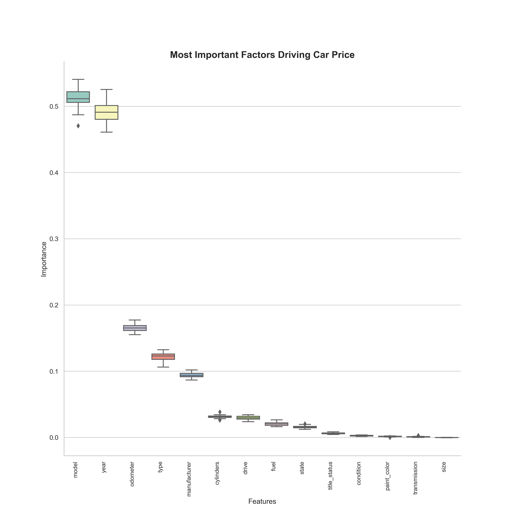

# What drives the price of a car?


**Context**

The goal of this project is to understand what factors make a car more or less expensive.  As a result of my analysis, I will provide clear recommendations as to what consumers value in a used car. 


**Data**

For this application, I will explore a dataset from kaggle. The original dataset contained information on 3 million used cars. The provided dataset contains information on 426K cars to ensure speed of processing.

**Disclaimer**

This is a summary of my analysis, findings, and recommendations. The full analysis can be found [here](prompt.ipynb).


### Business Understanding

**Business Objectives:**

Some important objectives of a used car dealership could be:

- Understand what are the main drivers of price in a used car (the main one, as mentioned above)
- Improve profit on each sale
- Optimize inventory to make sure all cars have a higher chance of sell (at a highest price possible)


### Data Problem Definition

Understand the key features that drive the price of a car. In order to do that, a univariate and multivariate analysis can be made on the given dataset (the business database) to create and train a model that can accurately (hopefully) predict the price of a car.


### Data Description

The dataset contains the following columns:

```
 #   Column        Non-Null Count   Dtype  
---  ------        --------------   -----  
 0   id            426880 non-null  int64  
 1   region        426880 non-null  object 
 2   price         426880 non-null  int64  
 3   year          425675 non-null  float64
 4   manufacturer  409234 non-null  object 
 5   model         421603 non-null  object 
 6   condition     252776 non-null  object 
 7   cylinders     249202 non-null  object 
 8   fuel          423867 non-null  object 
 9   odometer      422480 non-null  float64
 10  title_status  418638 non-null  object 
 11  transmission  424324 non-null  object 
 12  VIN           265838 non-null  object 
 13  drive         296313 non-null  object 
 14  size          120519 non-null  object 
 15  type          334022 non-null  object 
 16  paint_color   296677 non-null  object 
 17  state         426880 non-null  object 
 ```

## I. Initial Analysis

#### 1. How price behave? Can we identify drivers by looking at the data?

Some super old cars (prob considered reliques) are pretty expensive - aside from that, newer cars are more expensive. Makes sense.


Some Manufacturers also tend to be more expensive than others. Ferrari, Aston Martin, and Tesla are good examples of that.


The condition of the car also plays a role in the price. New cars are on average pricier (which makes perfect sense). But it's important to mention that the analysis will be concentrated on "used" cars as is stablished in the business goals.


## II. Hypotesis

$\color{green}{Hypothesis}$ **The price of a car is driven by year, manufacturer, and overall conditions of the car.** 

## III. Predictive Model 

#### 1. Data input

A couple models were built and optimized taking into consideration the following characteristics:

```
#   Column        
---  ------       
 0   manufacturer  
 1   model         
 2   cylinders     
 3   fuel          
 4   title_status  
 5   transmission  
 6   drive         
 7   size          
 8   type          
 9   paint_color   
 10  state         
 11  year          
 12  condition     
 13  odometer      
```
Just some of the data was used to train the model. A portion of the data (30% of the records) was saved for testing purposes to measure the accuracy of the model. 

#### 2. Model design

A couple of models (Polinomial Regresion and Ridge) were used to predict Price. Details on them can be found [here](prompt.ipynb).

#### 3. Model results

The linear regression model, with a R^2 score of `0.8627478459281825` (with a MAE of 850) turned out to the best one of the two - I will explain what those numbers mean in the analysis. This model gave the following results:

**analysing predictions**


$\color{orange}{Analysis}$

- Some predictions are negative - which doesn't make sense. Having said that, still is a good model (the score of 0.86 out of 1.0 proves it).
- The predictions following the same pattern of the real price. This is a good indication of performance.
- The model predicts the price of a car - on average - with a $850 difference in relation to the actual price. Not bad at all.


## IV. Evaluation

The predictive model was analyzed to understand what factors were more important to calculate the price of the car. The results are the following:




$\color{red}{Conclusion}$
The price of the car is driven by year, by model (not exactly manufacturer) and in less proportion, the "age" of the car reflected by the odometer.


## V. Next Steps & Recommendations

**Concentrate on the year and the model of the car**: Pulling the list of newer most relevant models in your inventory and concentrate on having those would be the best approach for the dealership. Don't worry too much about the paint, the gast type, the cylinders or the transmission. Those features won't matter that much in the end.

Here's are the most valuable models of 2021 as a head start:


**Dig deeper into the models database**: There's a lot of work to be done in the car models database. Car model is the most important feature of the car. Having a more complete database with more models and more information about them would increase the chances of predicting a car's price. The 50 most popular models where used for this analysis due to performance limitations. Adding them all to the prediction database would be a good next step.